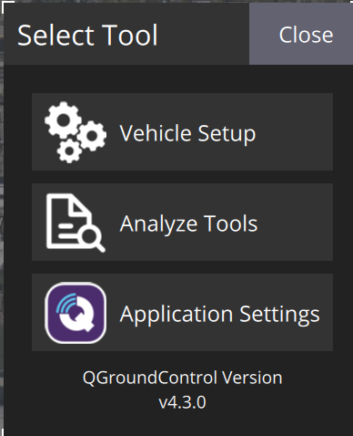
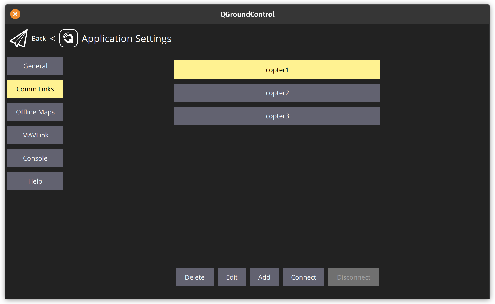
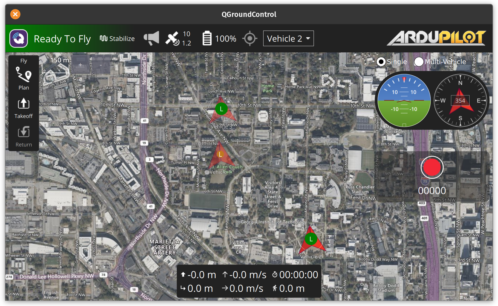

# x drones with ardupilot and QGroundControl

We are using the default ardupilot repository and we'll add definitions for drones.

Go to the ardupilot repository directory.

    $HOME/mygitrepos/ardupilot/Tools/autotest/pysim
    $HOME/mygitrepos/ardupilot/Tools/autotest/default_params

Set up copter1,2,3.parm files in `/path/to/ardupilot/repo/ardupilot/Tools/autotest/default_params`, the content is the same as copter.parm with just one line added at the end containing `SYSID_THISMAV 1` (and 2 and 3 in the corresponding copter2,copter3.parm files).

Open 3 terminals (or tabs), and in the directory `/path/to/ardupilot/repo/ardupilot/build/sitl/bin`, run:

    ./arducopter -S -I0 --home 33.779131,-84.402921,584,353 --instance 1 --model "+" --speedup 1 --defaults /home/ludofw/mygitrepos/ardupilot/Tools/autotest/default_params/copter1.parm

    ./arducopter -S -I0 --home 33.774938,-84.397531,584,353 --instance 2 --model "+" --speedup 1 --defaults /home/ludofw/mygitrepos/ardupilot/Tools/autotest/default_params/copter2.parm

    ./arducopter -S -I0 --home 33.781380,-84.402856,584,353 --instance 3 --model "+" --speedup 1 --defaults /home/ludofw/mygitrepos/ardupilot/Tools/autotest/default_params/copter3.parm

Open another terminal and 3 tabs, within which run:

    mavproxy.py --master tcp:127.0.0.1:5770 --out 127.0.0.1:14550 --out 127.0.0.1:14553

    mavproxy.py --master tcp:127.0.0.1:5780 --out udp:127.0.0.1:14551 --out 127.0.0.1:14554

    mavproxy.py --master tcp:127.0.0.1:5790 --out udp:127.0.0.1:14552 --out 127.0.0.1:14555

Then open QGC, setup the connection for 3 drones in application settings, comlink.

Click on connect for each connection.

Then the 3 drones will apear on the map at the specified lat and long:

References:
https://www.youtube.com/watch?v=UWsya46ZG4M

https://community.dojofordrones.com/t/simulate-multiple-vehicles-in-qgc-with-dronekit/992/6

https://github.com/Intelligent-Quads/iq_tutorials/blob/master/docs/swarming_ardupilot.md

